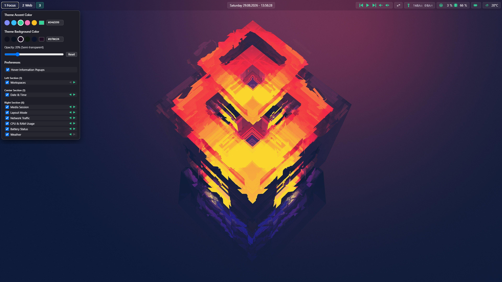
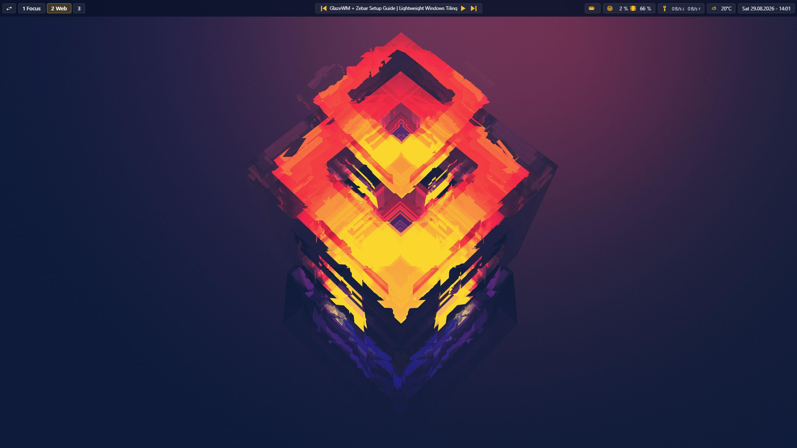
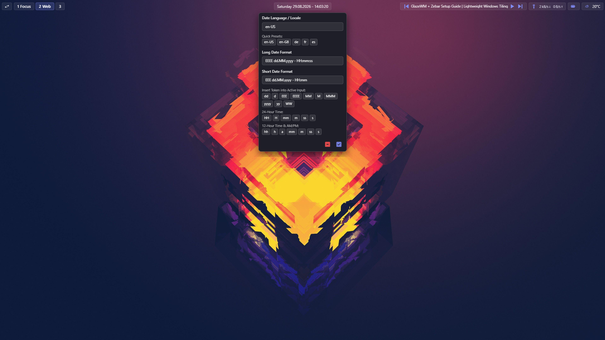
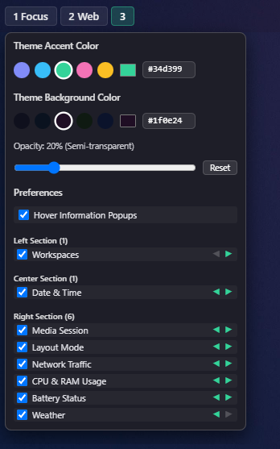
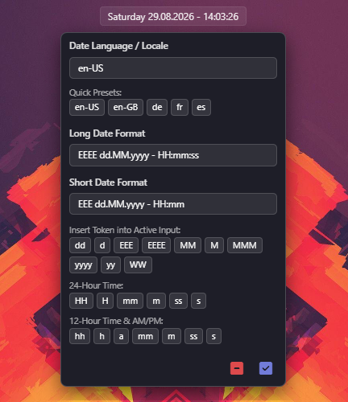
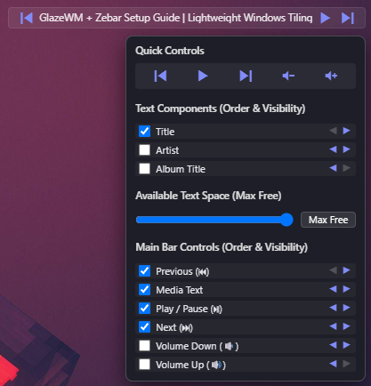
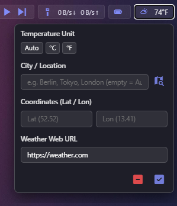
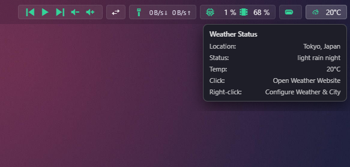

# Zebar Pure

The ultimate minimalist, distraction-free **Windows RICE status bar** for Zebar and GlazeWM. Built with React and TypeScript using native Zebar APIs.

---

## 📸 Desktop Overviews





---

## 🎛️ Interactive Menus & Customization

| Global Settings & Layout | Date & Time Configuration |
| :---: | :---: |
| <br><sub>**Theme Colors, Transparency & 3-Section Reordering**</sub> | <br><sub>**Custom Luxon Tokens & Locale Presets**</sub> |

| Media Controller & Scaling | Weather & City Search |
| :---: | :---: |
| <br><sub>**Modular Media Controls & Free-Space Scaling**</sub> | <br><sub>**Geocoding City Search & Units**</sub> |

| Live Hover Information Popovers |
| :---: |
| <br><sub>**1:1 Real-Time Live System & Hardware Metrics**</sub> |

---

## ✨ Highlights & Features

- **The Ultimate Windows RICE Status Bar**: Engineered for clean, aesthetic desktop setups with pixel-perfect typography, standard 24px flex alignment, and frameless flat glyphs.
- **Theme Accent & Complementary Dark Background Colors**:
  - Soft pastel accent presets (*Lavender*, *Sky*, *Mint*, *Rose*, *Amber*) + custom HEX color picker.
  - 5 matching dark complementary background presets (*Dark Slate*, *Midnight Navy*, *Dark Aubergine*, *Dark Forest*, *Dark Sapphire*) + custom HEX color picker.
- **Dynamic Transparency & Opacity Slider**: Smooth bar opacity control (0% fully transparent to 100% solid) with an instant **`[ Reset ]`** button back to 100% transparent.
- **Seamless 3-Section Layout Reordering**: Easily move modules across **Left**, **Center**, and **Right** bar positions using intuitive `[◀]` / `[▶]` buttons with automatic section boundary crossing.
- **Resource-Saving Module Visibility**: Toggle any module on or off in Global Settings. Disabled modules completely skip background polling, network calls, and timers (0% CPU/network waste).
- **Consolidated Media Applet**: Reorder media controls (`⏮`, `⏯`, `⏭`, `🔉`, `🔊`) and text sub-components (`Title`, `Artist`, `Album`) with `[◀]` / `[▶]`. Features dynamic free-space scaling with one-click `Max Free` mode for zero collision on any display resolution (720p to 8K).
- **Real-Time Dynamic Popover Sizing**: Automatically calculates actual DOM height (`getBoundingClientRect`) to size the Tauri window dynamically with zero cut-offs or scrollbars.
- **Adaptive Popover Alignment**: Popovers automatically align left (`left: 0`), center (`left: 50%`), or right (`right: 0`) depending on section placement to prevent off-screen clipping.
- **Global Hover Information Popups Toggle**: Simple `[x] Hover Information Popups` switch in Global Settings to completely silence hover popups for ultra-clean, distraction-free setups.
- **Custom Date & Time Settings**: Short and Long date format toggling via Left-Click. Customize Luxon tokens, locale/language presets (`en-US`, `de`, `fr`, `es`), and insert tokens at cursor position.
- **Network Layout Modes & Live Traffic**: Right-click Network to toggle between Fixed Width and Dynamic Width. Live download and upload speeds are mirrored 1:1 in the hover popover.
- **Battery Status & Offline Resilience**: Granular 10-step battery icons, low-power alerts (Orange <15%, Red <5%), and offline weather fallbacks (`-°C` without false sunny icons).

---

## 🚀 Getting Started & Installation

New to Windows Ricing? Here is how to get **Zebar Pure** running on Windows 10 or 11:

### 1. Install Zebar (and optionally GlazeWM)
Install Zebar via Windows Package Manager (winget) in PowerShell:
```powershell
winget install glzr-io.zebar
```
*(Optional tiling window manager)*:
```powershell
winget install glzr-io.glazewm
```

### 2. Install Zebar Pure

#### Option A: Zebar Marketplace (Recommended)
1. Open the Zebar GUI from your system tray.
2. Navigate to the **Marketplace** tab.
3. Search for **Zebar Pure** and click **Install**.

#### Option B: Manual Installation (Git Clone)
Clone or copy this repository into your Zebar directory:
```powershell
git clone https://github.com/LycosLane/zebar-pure.git "$env:APPDATA\zebar\downloads\lycoslane.zebar-pure@1.1.0"
```

### 3. Activate & Customize
1. In Zebar, open your widgets menu and click **"Reload Widgets"**.
2. Select **Zebar Pure** (`minimal`) as your active top status bar.
3. **Right-Click on the Workspaces applet** on the left to open **Zebar Pure Global Settings** and configure your colors, opacity, and layout order!

---

## ⌨️ Quick Controls & Shortcuts

| Applet | Left Click | Right Click | Hover Action |
| :--- | :--- | :--- | :--- |
| **Workspaces** | Switch workspace | Open Zebar Pure Global Settings | Workspaces Info Popover |
| **Date & Time** | Toggle Short / Long Date Format | Open Date & Time Settings | Date & Time Info Popover |
| **Media Title / Text** | Focus playing application | Open Media Controls & Settings | Media Session Info Popover |
| **Network** | Open Windows Network Settings | Toggle Fixed / Dynamic Width | Live In/Out Traffic Details |
| **CPU / Memory** | Open Task Manager | Swap CPU / RAM display order | CPU & RAM Usage Details |
| **Battery** | Open Windows Power Settings | Toggle percentage text display | Battery Level & Charging State |
| **Weather** | Open weather website | Open Weather & City Settings | Weather Status & Location |
| **Tiling Mode** | Toggle Horizontal / Vertical layout | — | Layout Mode Info Popover |

---

## 📜 Credits & Attribution

- Built by **LycosLane**.
- Originally inspired by concepts from `srcthird.frigid-zebar` by Stephen Chryn, completely re-engineered and redesigned into Zebar Pure.

## 📄 License

Open source under the [Apache-2.0 License](./minimal/LICENSE).
